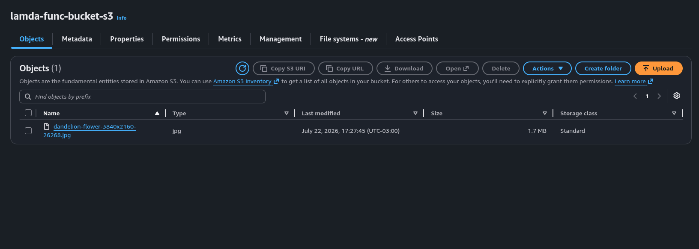
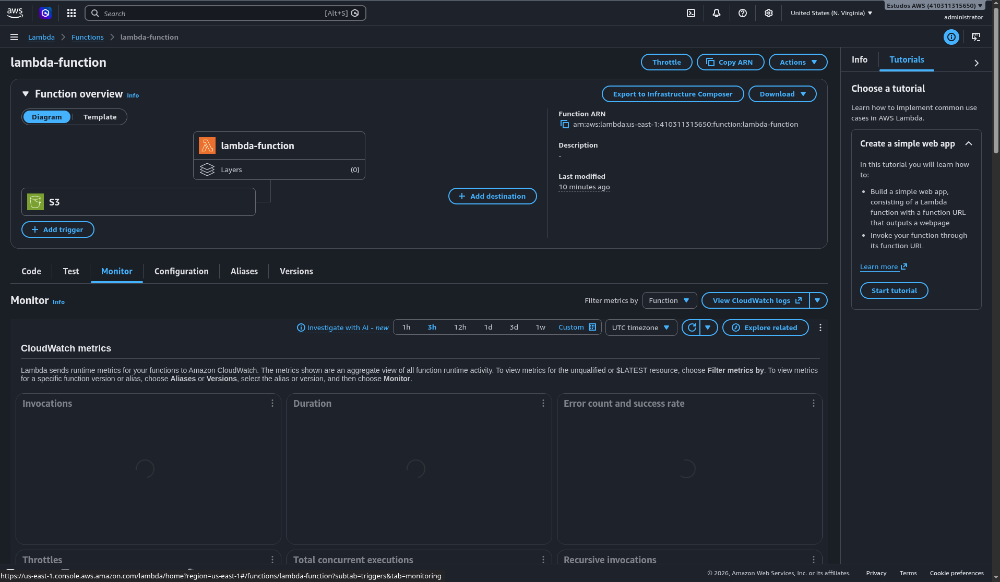
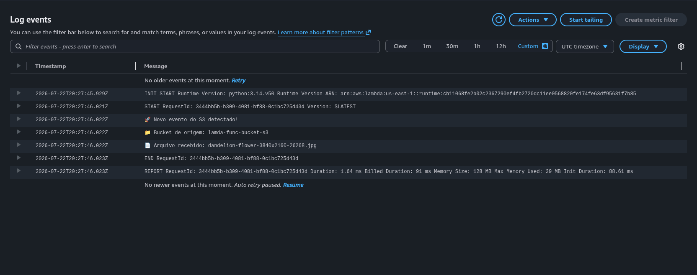

# Desafio DIO: Executando Tarefas Automatizadas com AWS Lambda e S3

Este repositório contém o projeto prático do bootcamp de Fundamentos de Cloud com AWS da [DIO](https://www.dio.me/) em parceria com a GFT. O objetivo é demonstrar a criação de uma automação orientada a eventos utilizando Amazon S3 e AWS Lambda.

## 🎯 Objetivo do Projeto

Automatizar um processo na nuvem onde o upload de um arquivo em um bucket S3 aciona (triga) uma função Lambda, que por sua vez processa as informações do evento e registra os logs no Amazon CloudWatch.

## 🏗️ Arquitetura

1. **Amazon S3:** Armazenamento de objetos. Atua como a origem (source) do evento.
2. **AWS Lambda:** Serviço de computação serverless. Executa o código em resposta ao evento do S3.
3. **IAM (Identity and Access Management):** Gerencia as permissões para que a Lambda possa ler o S3 e escrever no CloudWatch.
4. **Amazon CloudWatch:** Armazena os logs de execução e monitora a automação.

## 🛠️ Tecnologias Utilizadas

- AWS Console
- Amazon S3
- AWS Lambda (Linguagem: Python)
- AWS IAM
- Amazon CloudWatch

## 🚀 Passo a Passo da Implementação

1. **Criação do Bucket S3:** Foi criado o bucket `[lamda-func-bucket-s3]` com as configurações padrão de bloqueio de acesso público.
2. **Configuração de Permissões (IAM):** Criada uma role com as políticas `AWSLambdaBasicExecutionRole` e `AmazonS3ReadOnlyAccess`.
3. **Desenvolvimento da Lambda:** Função configurada para ser acionada sempre que um objeto do tipo `[ex: .jpg, .json, ou todos]` for inserido no bucket.
4. **Testes:** Ao realizar o upload de um arquivo no S3, a Lambda foi acionada com sucesso, o que pode ser verificado nos logs do CloudWatch.

## 📸 Evidências

### 1. Bucket S3 Criado

### 2. Gatilho (Trigger) Configurado na Lambda

### 3. Logs de Execução no CloudWatch

## 💡 Insights e Aprendizados

- **Event-Driven Architecture:** Foi muito interessante observar na prática como os serviços se comunicam de forma reativa. O S3 aciona a Lambda instantaneamente após o upload, eliminando a necessidade de gerenciar e manter um servidor rodando 24 horas por dia apenas para "escutar" a chegada de novos arquivos.
- **Permissões (IAM):** A etapa de criação da Role destacou a importância do Princípio do Menor Privilégio em nuvem. Ao limitar a função Lambda estritamente à leitura do S3 e escrita nos logs do CloudWatch, garantimos que a aplicação faça apenas o necessário, minimizando drasticamente os riscos de segurança.
- **Serverless:** O maior benefício perceptível foi o modelo de custo sob demanda. Saber que a cobrança ocorre apenas pelos milissegundos em que a Lambda está efetivamente executando o código — e que o custo enquanto a automação está ociosa é zero — demonstra o poder de escalabilidade financeira desse modelo.

---

*Projeto desenvolvido como requisito para o bootcamp da DIO.*
